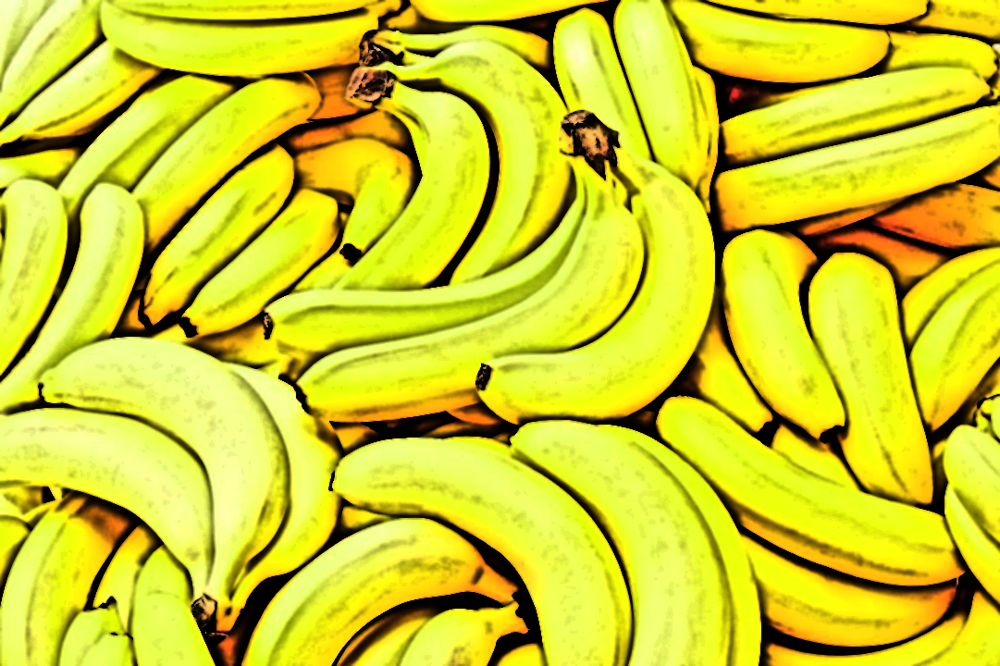
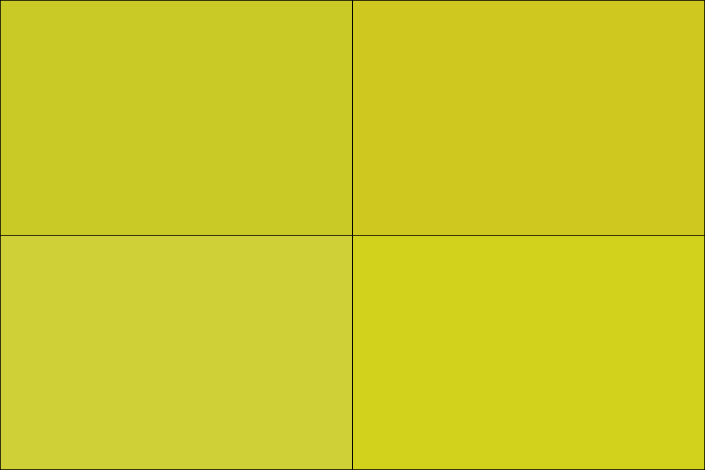
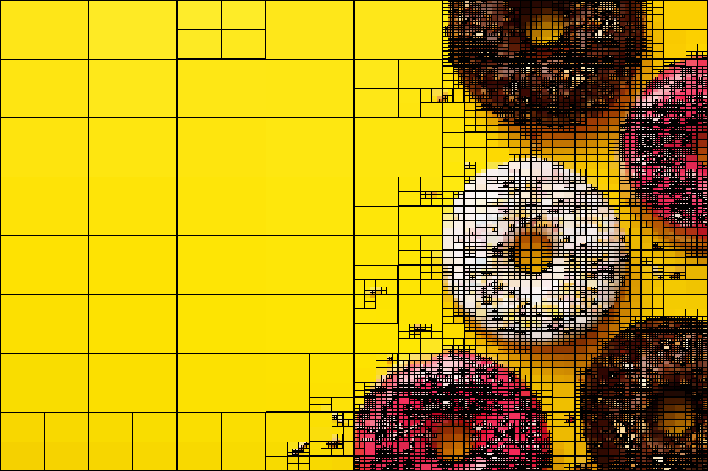
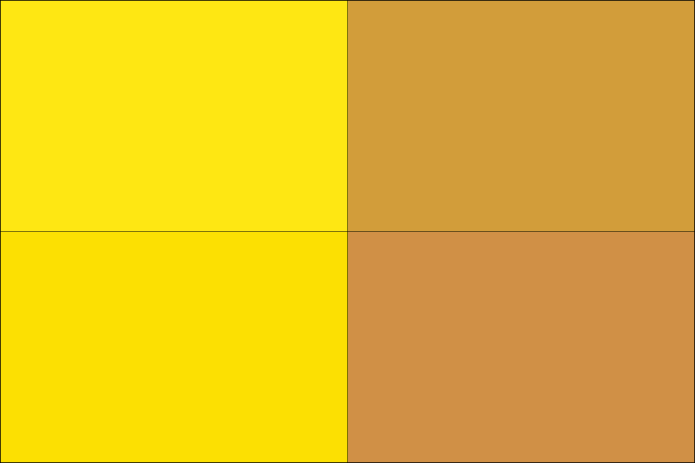

# QuadTree

Image Segmentation Animation using QuadTree concepts.

## Images








## Video


## Usage

```
usage: quad.py [-h] [-fps FPS] [-g] [-i ITERATIONS] [-b] [-img] [-s STEP] [-e ERROR] [-f] input output

Quadtree Image Segmentation.

positional arguments:
  input                 Image to segment.
  output                Output filename.

optional arguments:
  -h, --help            show this help message and exit
  -fps FPS              Output FPS.
  -g, --gif             Output as gif.
  -i ITERATIONS, --iterations ITERATIONS
                        Number of iterations.
  -b, --border          Add borders to subimages.
  -img, --image         Save final output image.
  -s STEP, --step STEP  Only save a frame every `(iteration)^s` iterations.
  -e ERROR, --error ERROR
                        Error type: Sum of Squared Error (sse), Min-Max Difference (minmax) or Max Difference (max).
  -f, --frames          Save frames.
```

## Dependencies

```
numpy
tqdm
imageio
imageio-ffmpeg

pip install numpy tqdm imageio
pip install imageio-ffmpeg --user
```