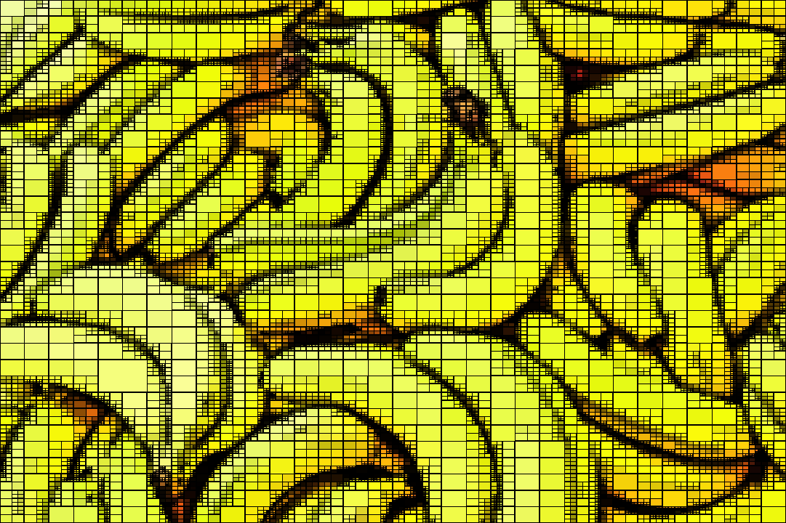
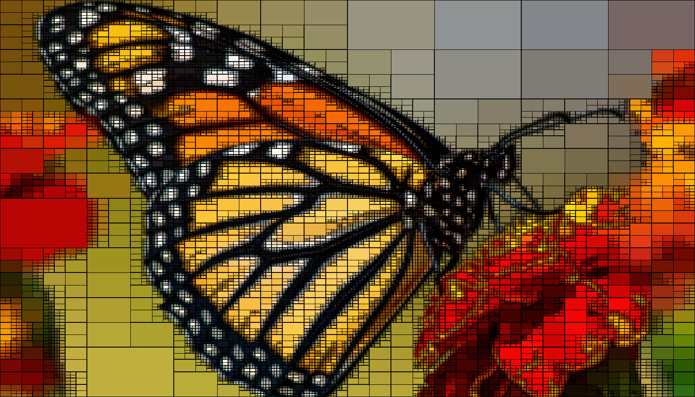
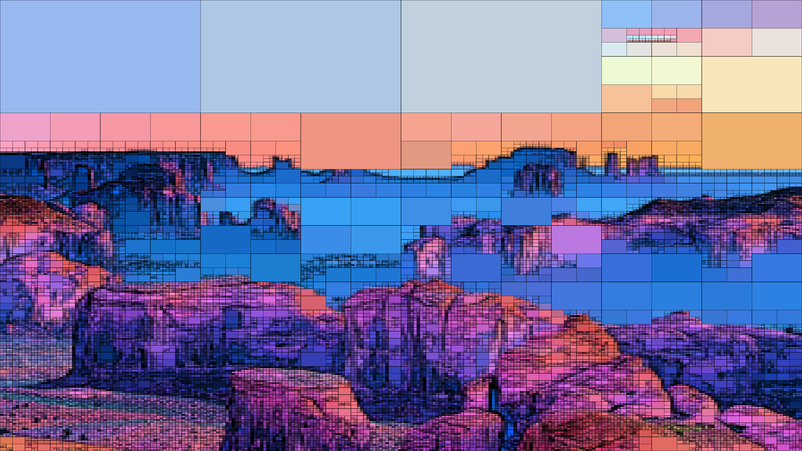
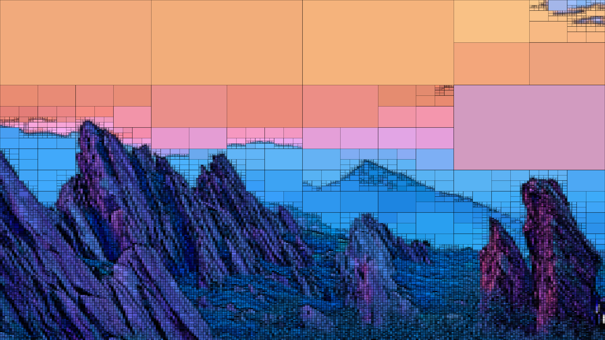
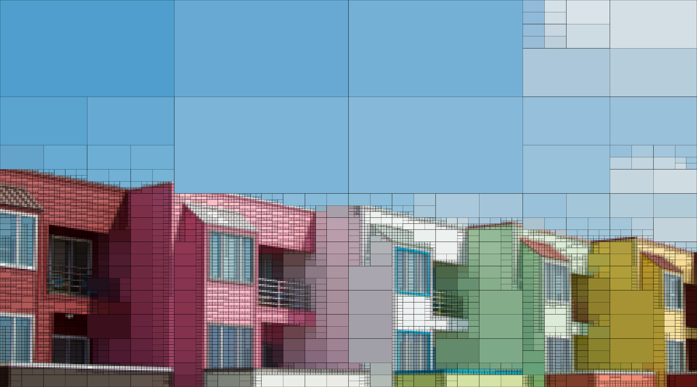

# QuadTree

Image Segmentation Animation using QuadTree concepts.

1. Split the Image into four quadrants.
2. Split the quadrant with the highest error into four quadrants.
3. Repeat N times.

## Images







## Video


## Usage

```
usage: quad.py [-h] [-fps FPS] [-q QUALITY] [-a] [-i ITERATIONS] [-b] [-img] [-s STEP] [-e ERROR] [-f] input output

Quadtree Image Segmentation.

positional arguments:
  input                 Image to segment.
  output                Output filename.

optional arguments:
  -h, --help            show this help message and exit
  -fps FPS              Output FPS.
  -q QUALITY, --quality QUALITY
                        Quality of the output video. (0-10), 0 worst, 10 best.
  -a, --animate         Save intermediary frames as video.
  -i ITERATIONS, --iterations ITERATIONS
                        Number of iterations.
  -b, --border          Add borders to subimages.
  -img, --image         Save final output image. For use with --animate only.
  -s STEP, --step STEP  Only save a frame every `s^(iteration)` iterations. For use with --animate only.
  -f, --frames          Save intermediary frames as images.
  -au, --audio          Add audio from the input file to the output file.
  -mw MINWIDTH, --minwidth MINWIDTH
                        Minimum width of the smallest image quadrant.
  -mh MINHEIGHT, --minheight MINHEIGHT
                        Minimum height of the smallest image quadrant.
```

## Dependencies

```
numpy
tqdm
imageio
imageio-ffmpeg

pip install numpy tqdm imageio
pip install imageio-ffmpeg --user
```