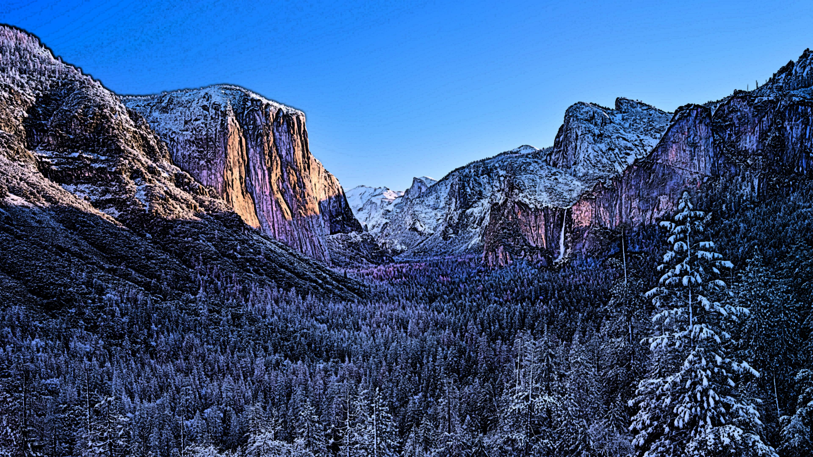
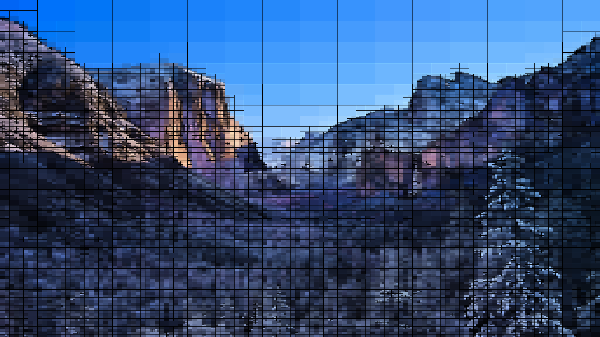

# QuadTree

Image Segmentation Animation using QuadTree concepts.

<p align="center">
    
    
    
    
    
    
    
    
    
</p>

## Usage

```
usage: quad.py [-h] [-fps FPS] [-i ITERATIONS] [-ws WRITESTART] [-b] [-img] [-s STEP] input output

Quadtree Image Segmentation.

positional arguments:
  input                 Image to segment.
  output                Output filename.

optional arguments:
  -h, --help            show this help message and exit
  -fps FPS              Output FPS.
  -i ITERATIONS, --iterations ITERATIONS
                        Number of iterations.
  -ws WRITESTART, --writestart WRITESTART
                        Number of frames to write in sequence initially.
  -b, --border          Add borders to subimages.
  -img, --image         Save final output image.
  -s STEP, --step STEP  Once `iterations > ws`, only save a frame every `(iterations - ws)^s` iterations.
```

## Dependencies

```
numpy
tqdm
imageio
imageio-ffmpeg

pip install numpy tqdm imageio
pip install imageio-ffmpeg --user
```